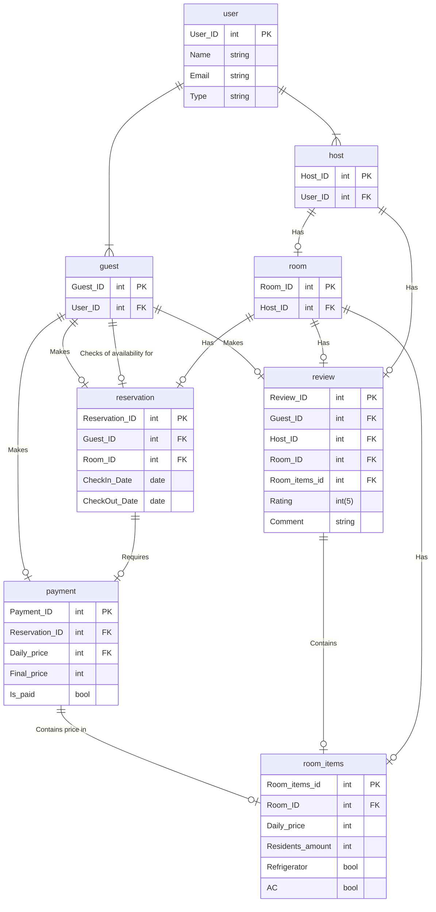

Create a data model for a [AirBnb.com](http://airbnb.com/) system. 
- Your model should give ability to store information about the:

	- users | You should have two types of users:

		- Hosts
			- Host should be able to:
				- create rooms with different attributes (amount of residents, price, A/C, refrigerator, etc.)

		- Guests
			- Guest should be able to make a:
				- Check availability of any rooms
				- Make Reservation for a room.
				- (Optional):
					- Pay for reservation
					- Review for the host.

	- the rooms, 
	- the reservations, 
	- the reviews

For each table you should describe what is the primary key and what are the foreign keys (if any).

Result of the work might be description in a table.
You can create tables in text file with description of each field. 

(Optional): Add this possibilities for a guest
- Pay for reservation
- Review for the host.

-------------------------------------------------------------------------
List of this tool: [https://www.holistics.io/blog/top-5-free-database-diagram-design-tools/](https://www.holistics.io/blog/top-5-free-database-diagram-design-tools/)

You also can use any graphic tool that you might use to create data model. For example use [DRAW.io](http://draw.io/).
------------------------------------------------------------------------

