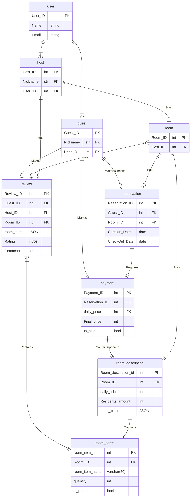

```markdown
1. Write SQL queries for table creation for a data model that you created for prev homework (Airbnb model)

2. Write 3 rows (using INSERT queries) for each table in the data model

3. Create the next analytic queries:

      1. Find a user who had the biggest amount of reservations. Return user name and user_id

      2. (Optional) Find a host who earned the biggest amount of money for the last month. Return hostname and host_id

      3. (Optional) Find a host with the best average rating. Return hostname and host_id

```


